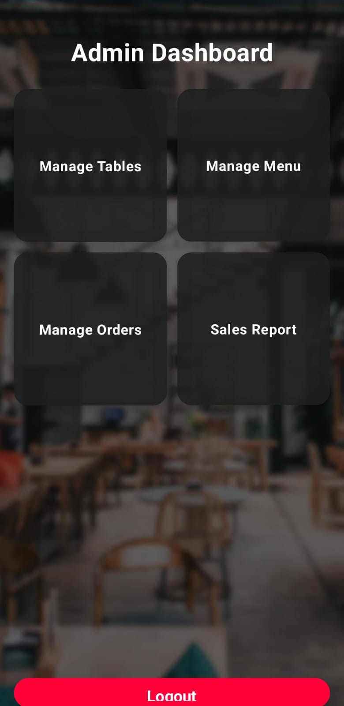
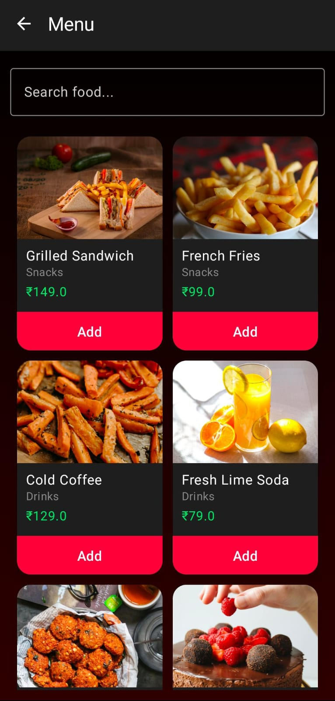

# 🍽️ Smart Restaurant Manager

  
  
  


A modern Android application built using **Kotlin**, **Jetpack Compose**, **Room**, and **Hilt** for complete restaurant order and sales management.

---

## 🚀 Overview

**Smart Restaurant Manager** is a feature-rich Android app designed to streamline restaurant operations — from table management to order handling and analytics visualization.  
Built with Kotlin, Jetpack Compose, and Room Database, it ensures a **smooth, responsive, and modern experience**.

---

## ✨ New Features Implemented

### 🖼️ Image Support
- 📸 **Camera Integration** – Capture photos for menu items  
- 🖼️ **Gallery Selection** – Choose images directly from the device  
- 🗂️ **Local Storage** – Images securely stored on-device  
- 🧩 **Image Display** – Real image components for menu and orders  

### 📊 Real Charts & Analytics
- 📈 **MPAndroidChart Integration** – Professional analytics library  
- 📊 **Interactive Charts** – Touch, zoom, and pan enabled  
- 🔁 **Live Data Updates** – Real-time sales tracking  
- 📅 **Multiple Chart Types** – Sales, profits, and trends  

### 🪑 Table Management System
- 🗺️ **Floor Plan View** – Visual layout of restaurant tables  
- 🔄 **Status Tracking** – Available, Occupied, Reserved, Cleaning  
- 🏷️ **Location Filtering** – Main Hall, Patio, VIP, Private Room  
- ➕ **Add/Edit Tables** – Dynamic table creation and modification  

### 🍽️ Order Modifications
- 🧾 **Custom Requests** – Special kitchen instructions  
- 🪄 **Quick Modifications** – Add “No onions”, “Extra sauce”, etc.  
- 🎨 **Visual Indicators** – Color-coded modification states  
- 📜 **Order History** – Track changes per item  

### 🌍 Multi-Language Support
- 🌐 **3 Languages** – English, Spanish, French  
- 🔁 **Dynamic Switching** – No restart needed  
- 💾 **Language Persistence** – Remembers last used language  

---

## 🛠️ Technical Implementation

### 🧩 Architecture
- 🧠 **MVVM Pattern** – Clean separation of logic and UI  
- 🧱 **Room Database v2** – Offline-first data management  
- 🧭 **Navigation Compose** – Declarative navigation  
- 🧩 **Hilt Dependency Injection** – Efficient DI  
- 🎨 **Material Design 3** – Modern and consistent UI  

### 🗄️ Database Schema

| Entity | Description |
|--------|--------------|
| **Users** | Authentication and user data |
| **RestaurantTable** | Table layout and seat info |
| **MenuItems** | Food and beverage data with images |
| **Orders** | Complete order tracking |
| **OrderItems** | Items within each order |
| **SalesData** | Analytics and historical sales |

### 🧰 Dependencies
```kotlin
// Image handling
implementation("io.coil-kt:coil-compose:2.5.0")

// Camera and image picker
implementation("androidx.camera:camera-core:1.3.1")
implementation("androidx.camera:camera-camera2:1.3.1")
implementation("androidx.camera:camera-lifecycle:1.3.1")
implementation("androidx.camera:camera-view:1.3.1")

// Charts
implementation("com.github.PhilJay:MPAndroidChart:v3.1.0")
```

---

## 📱 App Preview

<p align="center">
  
  
  
</p>

🎬 **Demo Video**

🎥 [Watch Demo Video](https://github.com/shaik-mohammad-parvez/Smart-Restaurant-Manager/blob/main/Smart_Restaurant_Manager_Demo.mp4)

---

## 📱 App Walkthrough

### 1️⃣ Authentication System
- Sign-up and login with validation  
- Local user storage via Room  
- Error handling and toast feedback  

### 2️⃣ Dashboard & Analytics
- Real-time interactive charts  
- Daily / Weekly / Monthly / Yearly filters  
- Summary cards for profits, sales, and averages  

### 3️⃣ Order Management
- Menu browsing by category (Food/Beverages)  
- Add to cart with live total  
- Manage quantities and special requests  
- Order summary + tax + payment screen  

### 4️⃣ Table Management
- Visual floor layout  
- Real-time status update (Available / Reserved / Cleaning)  
- Add new tables dynamically  
- Quick actions for table updates  

### 5️⃣ Multi-Language System
- Instant switching between English, Spanish, French  
- Translated UI and strings  
- Language preference persistence  

---

## 🧠 Key Strengths
✅ Real image integration (Camera + Gallery)  
✅ MPAndroidChart-powered analytics  
✅ Floor-plan-based table management  
✅ Order modifications and history  
✅ Multi-language adaptability  
✅ Secure local authentication  
✅ 100% Offline functionality  

---

## ⚙️ Setup & Installation

### Prerequisites
- Android Studio Hedgehog (2023.1.1) or higher  
- Kotlin 1.9.10+  
- Android SDK API 24+ (Android 7.0)

### Steps
```bash
# Clone the repository
git clone https://github.com/shaik-mohammad-parvez/Smart-Restaurant-Manager.git

# Open in Android Studio
# Sync Gradle and build project
# Run on emulator or physical device
```

---

## 🔮 Future Enhancements
☁️ Firebase cloud sync  
💳 Real payment integration  
🧾 Inventory & staff management  
🤖 AI-powered analytics  
📱 Customer-facing app  
🔢 QR code table ordering  

---

## 🏁 Summary
✅ Authentication System  
✅ Real Image Support (Camera & Gallery)  
✅ Interactive Charts with MPAndroidChart  
✅ Table Management with Floor Layout  
✅ Order Modifications & History  
✅ Multi-language (English, Spanish, French)  
✅ Offline Functionality  
✅ Room Database with Hilt & Compose  

**Smart Restaurant Manager** brings a modern UI, real-time analytics, and complete offline capabilities to restaurant management — ready for real-world deployment. 🚀
